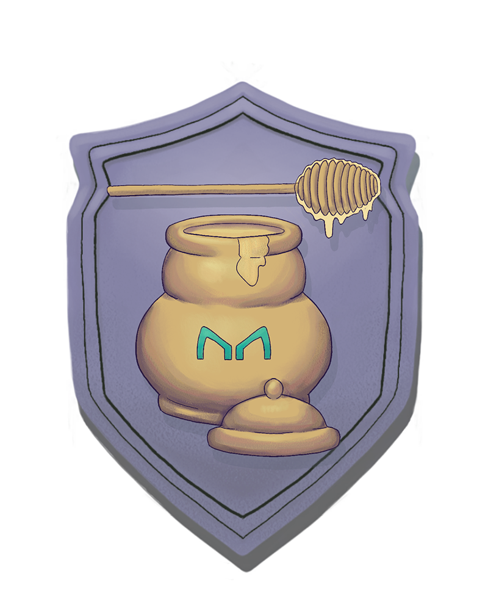

[](https://ubuntu.com/download/desktop)
[](https://github.com/nvm-sh/nvm#installation-and-update)
[](https://www.trufflesuite.com/)
[](https://github.com/ethereum/solidity/releases/tag/v0.6.12)
[](#project-deployed-on-kovan)

[](https://hackathon.money/)



# Maker Badges

> Non-transferable Badges for Maker Ecosystem Activity, CDIP [18](https://github.com/makerdao/community/issues/537), [29](https://github.com/makerdao/community/issues/721)

An incentive protocol to enhance activity on MakerDAO Ecosystem  

## Mentors
- Mariano Conti, [@nanexcool](https://github.com/nanexcool)
- Josh Crites, [@critesjosh](https://github.com/critesjosh)
- Yannis Stamelakos, [@i-stam](https://github.com/i-stam)
- Dror Tirosh (OpenGSN), [@drortirosh](https://github.com/drortirosh)

[Demo](https://youtu.be/oZhXjtDnKBM)  
[HackMoney](https://hack.ethglobal.co/showcase/metabadges-recJS9yRU2zu4rksZ)  

## Sections
* [Building Blocks](#building-blocks)
* [Setup](#setup)
* [Deploy](#deploy)
* [Interface](#interface)
* [Backend](#backend)
* [About](#about)

Building Blocks
===============


### [MakerBadges](./contracts/MakerBadges.sol)
> MakerBadges to check for activities on MakerDAO ecosystem and keep track of redeemers

To enable MakerBadges to check on-chain for activities on MakerDAO ecosystem we're using three interface to map the functions that we'll use:
- **Chai**: to check if a user has accrued 1 or more Dai from DSR (Pot), via **dai** used in Chai contract to return the **wad** or the current accrued Dai interest in DSR.  
To check redeemer activities on Pot it uses **chaiChallenge** function.    
- **DSChief**: to check if a user is voting in an Executive Spell via **votes** a getter function to check who is currently voting.  
To check redeemer activities on DSChief it uses **chiefChallenge** function.    
- **VoteProxy**: to check if a user is voting in an Executive Spell via **VoteProxy** contract, a proxy identity for cold and hot wallets.  
To check redeemer activities on DSChief via proxy it uses **robotChallenge** that requires the proxy address used to vote.  
- **Flipper**: to check for high bidder in the current Bid in Collateral Auctions via **bids** a getter function of current Bid on Flipper to check for **guy** the high bidder.   
To check redeemer activities on Flipper it uses **flipperChallenge** function.  

The functions to check on-chain for activities on Maker Ecosystem will keep track of the caller address into the OpenZeppelin EnumerableSet.AddressSet **redeemers** by templateId that will be verified in BadgeFactory via **verify** function linked to it, to allow a redeemer to activate a Non-transferable Badge.

The contract also inherits OpenZeppelic AccessControl.sol, allowing the owner of the contract to be set as Default Admin and Pauser to call **pause**, **unpause** functions in case of emergency (Circuit Breaker Design Pattern).  

### [BadgeRoles](./contracts/BadgeRoles.sol)
> BadgeRoles Access Management for Default Admin, Admin, Templater and Pauser Role

BadgeRoles inherits the OpenZeppelin AccessControl.sol, allowing the owner of the contract to be set as Default Admin, Admin, Pauser and also as Templater, to add an Admin via **addAdmin** and remove an Admin via **removeAdmin** functions as well as to add a Templater via **addTemplater** and remove a Templater via **removeTemplater** functions.  

### [BadgeFactory](./contracts/BadgeFactory.sol)
> BadgeFactory to manage Templates and activate Non-transferable Badges for redeemers

To enable BadgeFactory to verify redeemers checked on-chain/off-chain for activities on MakerDAO ecosystem, when they try to redeem their Badge, we're using the interface **MakerBadges** to map the function we'll use.  

In particular, we'll use:
- **verify** to verify redeemers checked on-chain.

BadgeFactory let the admin to set (via **setRootHashes**) an array of root hashes, called **roots**, ordered by template Id to allow redemeers checked off-chain for activities via TheGraph on the front-end, and stored into a Merkle Tree, to redeem Badges.

A Merkle Tree is generated for every Template and the root hash is updated by the admin of BadgeFactory daily to allow batches of redeemers to be checked and to redeem Badges.  

BadgeFactory inherits BadgeRoles, allowing a Templater to create a new template via **createTemplate** specifying name, description and image. A Templater can also update the template info via **updateTemplate**.

It also inherits ERC721, where the **_transfer** has been overridden to implement the non-transferable feature, allowing redeemers checked on-chain/offchain to redeem a Badge for a specific activity on MakerDAO ecosystem via **activateBadge** that will verify if the caller is a redeemer and then will allow the caller to mint a new Non-transferable Badge with tokenURI stored on IPFS (eg. "ipfs.json").  

To avoid that a redeemer could activate the same Badge twice, the **tokenId** is generated via **_getTokenId"** that concatenates the **redeemer** and the **templateId** to get a unique hard-coded identifier. The **_mint** function will check then if the tokenId already exists (= already minted) and if not mint a new Badge.  

Finally **setBaseURI** is added to allow the admin to set a new baseURI.  

During deployment the contract sets the following ERC721 metadata:
- name: "MakerBadges"
- symbol: "MAKER"
- baseURI: "https://badges.makerdao.com/token/"  

Setup
============

Clone this GitHub repository.

## Steps to compile and test

  - Local dependencies:
    - Truffle
    - Ganache CLI
    - OpenZeppelin Contracts 
    - Truffle HD Wallet Provider
    - Truffle-Flattener
    - Solhint
    ```sh
    $ yarn
    ```
  - Global dependencies:
    - Truffle (recommended):
    ```sh
    npm install -g truffle
    ```
    - Ganache CLI (recommended):
    ```sh
    npm install -g ganache-cli
    ```
    - Slither (optional):
    ```sh
    $ git clone https://github.com/crytic/slither.git && cd slither
    $ sudo python3 setup.py install
    ```
    - MythX CLI (optional):
    ```sh
    $ git clone git://github.com/dmuhs/mythx-cli && cd mythx-cli
    $ sudo python setup.py install
    ```
    - Echidna (optional):  
    [binaries](https://github.com/crytic/echidna/releases)  
    
## Running the project with local test network (ganache-cli)

   - Compile the smart contracts using Truffle with the following command (global dependecy):
     ```sh
     $ truffle compile
     ```
   - Deploy the smart contracts using Truffle & Ganache with the following command (global dependency):
     ```sh
     $ truffle migrate
     ```
   - Test the smart contracts using Mocha & OpenZeppelin Test Environment (Forking Mainnet):
     - Add Infura Key in ```config.js```
     - Run the following command:
     ```sh
     $ npm test
     ```
   - Analyze the smart contracts using Slither with the following command (optional):
     ```sh
     $ slither .
     ```
   - Analyze the smart contracts using MythX CLI with the following command (optional):
     ```sh
     $ mythx analyze
     ```
   - Analyze the smart contracts using Echidna with the following command (optional):
     ```sh
     $ echidna-test . --contract CryticTestBadgeRoles --config echidna_crytic_default.yaml
     ```
Deploy
============
## Deploy on Kovan Testnet
 - Get an Ethereum Account on Metamask.
 - On the landing page, click “Get Chrome Extension.”
 - Create a .secret file cointaining the menomic.
 - Get some test ether from a [Kovan's faucet](https://faucet.kovan.network/).
 - Signup [Infura](https://infura.io/).
 - Create new project.
 - Copy the kovan URL into truffle-config.js.
 - Uncomment the following lines in truffle-config.js:
   ```
   // const HDWalletProvider = require("@truffle/hdwallet-provider");
   // const infuraKey = '...';
   // const infuraURL = 'https://kovan.infura.io/...';

   // const fs = require('fs');
   // const mnemonic = fs.readFileSync(".secret").toString().trim();
   ```
 - Install Truffle HD Wallet Provider:
   ```sh
   $ npm install @truffle/hdwallet-provider
   ```
 - Deploy the smart contract using Truffle & Infura with the following command (global dependency):
   ```sh
   $ truffle migrate --network kovan
   ```

## Project deployed on Kovan
[MakerBadges](https://kovan.etherscan.io/address/0xF64510B7aDa1E0De35C243984957cB6c547D6C47)  
[BadgeFactory](https://kovan.etherscan.io/address/0x9f00d92d8858D1d1E42EA4aD7333a2BE3f1C8997)    

Interface
============

- [Frontend](https://github.com/scottrepreneur/maker-badges/tree/master/packages/frontend)

Backend
=======
- [Merkle Service](https://github.com/scottrepreneur/maker-badges/tree/master/packages/api)

About
============
## Inspiration & References

- [open-proofs](https://github.com/rrecuero/open-proofs)
- [ERC1238](https://github.com/ethereum/EIPs/issues/1238)
- [ERC721](https://eips.ethereum.org/EIPS/eip-721)
- [POAP](https://www.poap.xyz/)
- [MakerDAO](https://makerdao.com/en/)
- [Chai](https://chai.money/about.html)
- [aztec-airdrop](https://github.com/nanexcool/aztec-airdrop)

## Authors

Project created by [Nazzareno Massari](https://nazzarenomassari.com) and Scott Herren.  
A special thanks for support to [Gonzalo Balabasquer](https://github.com/gbalabasquer).  
Security Check by [Scott Bigelow](https://github.com/epheph)  
MakerDAO Badge Illustrations by [Richard Rosa](https://www.artstation.com/artwork/oAJeVq)
