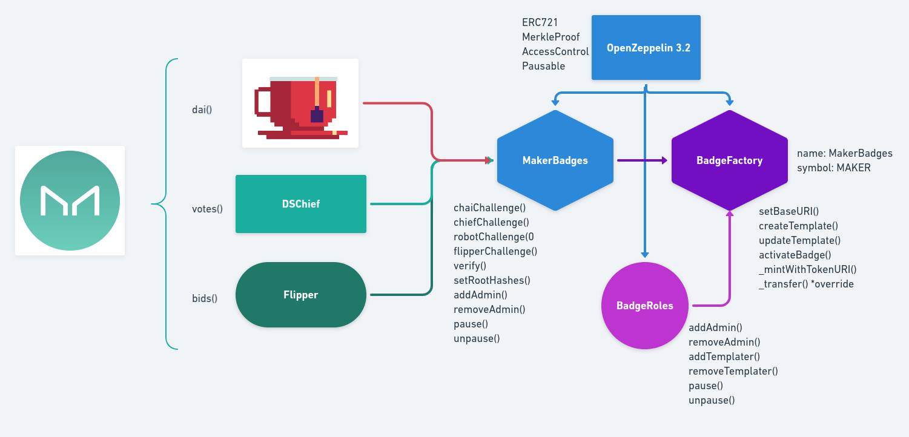

[](https://ubuntu.com/download/desktop)
[](https://github.com/nvm-sh/nvm#installation-and-update)
[](https://www.trufflesuite.com/)
[](https://github.com/ethereum/solidity/releases/tag/v0.6.9)
[]()

[](https://hackathon.money/)

# Maker Badges

> Non-transferable Badges for Maker Ecosystem Activity, [CDIP 18](https://github.com/makerdao/community/issues/537)  

An incentivization protocol to enhance activity on MakerDAO Ecosystem  

## Mentors
- Mariano Conti, [@nanexcool](https://github.com/nanexcool)
- Josh Crites, [@critesjosh](https://github.com/critesjosh)
- Yannis Stamelakos, [@i-stam](https://github.com/i-stam)
- Dror Tirosh (OpenGSN), [@drortirosh](https://github.com/drortirosh)

[Demo](https://youtu.be/oZhXjtDnKBM)  
[HackMoney](https://hack.ethglobal.co/showcase/metabadges-recJS9yRU2zu4rksZ)  

## Sections
* [Building Blocks](#building-blocks)
* [Setup](#setup)
* [Deploy](#deploy)
* [Front-end](#front-end)
* [About](#about)

## Building Blocks



### [MakerBadges](./contracts/MakerBadges.sol)
> MakerBadges to check for activities on MakerDAO ecosystem and keep track of redeemers

To enable MakerBadges to check on-chain for activities on MakerDAO ecosystem we're using three interface to map the functions that we'll use:
- **Pot**: to check if a user has accrued 1 or more Dai from DSR, via **pie(address guy)**, **chi()**, **rho()** and **drip()** used in the internal function **_dai(address guy)** to return the **wad** or the current accrued Dai interest in DSR.  
To check redeemer activities on Pot it uses **potChallenge(uint templateId)** function.    
- **DSChief**: to check if a user is voting on a Governance Poll via **votes(address)** a getter function to check who is currently voting.  
To check redeemer activities on DSChief it uses **chiefChallenge(uint templateId)** function.    
- **Flipper**: to check for high bidder in the current Bid in Collateral Auctions via **bids(id)** a getter function of current Bid on Flipper to check for **bids(id).guy** the high bidder.   
To check redeemer activities on Flipper it uses **flipperChallenge(uint templateId, uint bidId)** function.  

The functions to check on-chain for activities on Maker Ecosystem will keep track of the caller address into the OpenZeppelin EnumerableSet.AddressSet **redeemers** by templateId that will be verified in BadgeFactory via **verify(uint templateId, address guy)** function linked to it, to allow a redeemer to activate a Non-transferable Badge.

MakerBadges, let the owner to set (via **setRootHashes(bytes32[]) memory rootHashes**) an array of root hashes, called **roots**, ordered by template Id to allow redemeers checked off-chain for activities via TheGraph on the front-end, and stored into a Merkle Tree, to activate Badge.
The getter function **roots(uint templateId)** is then linked to BadgeFactory and checked via OpenZeppelin MerkleProof.sol **verify()** function.

The contract also inherits OpenZeppelic AccessControl.sol to set the Pauser role to the owner of the contract that can **pause()**, **unpause()** functions in case of emergency (Circuit Breaker Design Pattern).

### [BadgeRoles](./contracts/BadgeRoles.sol)
> BadgeRoles Access Management for Default Admin, Templater and Pauser Role

BadgeRoles inherits the OpenZeppelin AccessControl.sol, allowing the owner of the contract to be set as Default Admin, Pauser and also as Templater to add a Templater via **addTemplater(address guy)** and remove a Templater via **removeTemplater(address guy)** functions.  

### [BadgeFactory](./contracts/BadgeFactory.sol)
> BadgeFactory to manage Templates and activate Non-transferable Badges for redeemers

To enable BadgeFactory to verify redeemers checked on-chain/off-chain for activities on MakerDAO ecosystem, when they try to redeem their Badge, we're using the interface InsigniaDAO to map the function we'll use.  

In particular, we'll use:
- **verify(address guy)** to verify redeemers checked on-chain.
- **roots(uint templateId)** a getter function to return root by templated Id to be verified via MerkleProof.sol **verify()** function, allowing redeemers checked off-chain and stored into a Merkle Tree to be able to redeem Badges.  

A Merkle Tree is generated for every Template and the root hash is updated by owner of MakerBadges daily to allow batches of redeemers to be checked and to redeem Badges.  

BadgeFactory inherits BadgeRoles, allowing a Templater to create a new template via **createTemplate()** specifying name, description and image.  

It also inherits ERC721Burnable, where the **_transfer()** has been overridden to implement Non-transferable feature, allowing redeemers checked on-chain/offchain to redeem a Badge for a specific activity on MakerDAO ecosystem via **activateBadge()** that will verify if the caller is a redeemer and then will allow the caller to mint a new Non-transferable Badge with tokenURI stored on IPFS (eg. "ipfs.json").      
The owner of the Badge can then burn it eventually via **burnBadge(uint tokenId)** specifying the token Id of the Badge.  

During deployment the contract sets the following ERC721 metadata:
- name: "MakerBadges"
- symbol: "MAKER"
- baseURI: "https://badges.makerdao.com/token/"  

Setup
============

Clone this GitHub repository.

# Steps to compile and test

  - Local dependencies:
    - Truffle
    - Ganache CLI
    - OpenZeppelin Contracts v3.0.1
    - Truffle HD Wallet Provider
    - Truffle-Flattener
    ```sh
    $ npm i
    ```
  - Global dependencies:
    - Slither (optional): 
    ```
    pip3 install slither-analyzer
    ```
    - MythX CLI (optional):
    ```sh
    $ git clone git://github.com/dmuhs/mythx-cli
    $ sudo python setup.py install
    ```
## Running the project with local test network (ganache-cli)

   - Start ganache-cli with the following command:
     ```sh
     $ ganache-cli
     ```
   - Compile the smart contract using Truffle with the following command:
     ```sh
     $ truffle compile
     ```
   - Deploy the smart contracts using Truffle & Ganache with the following command:
     ```sh
     $ truffle migrate
     ```
   - Test the smart contracts using Truffle & Ganache with the following command:
     ```sh
     $ truffle test
     ```
   - Analyze the smart contracts using Slither with the following command (optional):
      ```
      $ slither .
      ```
   - Analyze the smart contracts using MythX CLI with the following command (optional):
     ```sh
     $ mythx analyze
     ```
## MythX CLI Report
Contract | Line | SWC Title | Severity | Short Description
--- | --- | --- | --- | ---
MakerBadges.sol | [112](https://github.com/naszam/maker-badges/blob/master/contracts/MakerBadges.sol#L112)| Timestamp Dependence | Low | A control flow decision is made based on The block.timestamp environment variable.

Deploy
============
## Deploy on Kovan Testnet
 - Get an Ethereum Account on Metamask.
 - On the landing page, click “Get Chrome Extension.”
 - Create a .secret file cointaining the menomic.
 - Get some test ether from a [Kovan's faucet](https://faucet.kovan.network/).
 - Signup [Infura](https://infura.io/).
 - Create new project.
 - Copy the rinkeby URL into truffle-config.js.
 - Uncomment the following lines in truffle-config.js:
   ```
   // const HDWalletProvider = require("@truffle/hdwallet-provider");
   // const infuraKey = '...';
   // const infuraURL = 'https://kovan.infura.io/...';

   // const fs = require('fs');
   // const mnemonic = fs.readFileSync(".secret").toString().trim();
   ```
 - Install Truffle HD Wallet Provider:
   ```sh
   $ npm install @truffle/hdwallet-provider
   ```
 - Deploy the smart contract using Truffle & Infura with the following command:
   ```sh
   $ truffle migrate --network kovan
   ```

## Project deployed on Kovan
[MakerBadges.sol](https://kovan.etherscan.io/address/0x7f1d746Bb965663c284dC484c25F6AD457a6b736)  
[BadgeFactory.sol](https://kovan.etherscan.io/address/0xb2Fde6157Ee76742C719DDbdfDA48c3dCE9D521E)


Front-end 
============

- [DApp](https://github.com/scottrepreneur/meta-badges)
- [Merkle Service](https://github.com/scottrepreneur/mb-merkle-service)

About
============
## Inspiration & References

- [open-proofs](https://github.com/rrecuero/open-proofs)
- [EIP issue #1238](https://github.com/ethereum/EIPs/issues/1238)
- [ERC721](https://eips.ethereum.org/EIPS/eip-721)
- [POAP](https://www.poap.xyz/)
- [MakerDAO](https://makerdao.com/en/)
- [Chai](https://chai.money/about.html)
- [aztec-airdrop](https://github.com/nanexcool/aztec-airdrop)

## Authors

Project created by [Nazzareno Massari](https://nazzarenomassari.com) and Scott Herren.  
Team MetaBadges from HackMoney ETHGlobal Virtual Hackathon.
